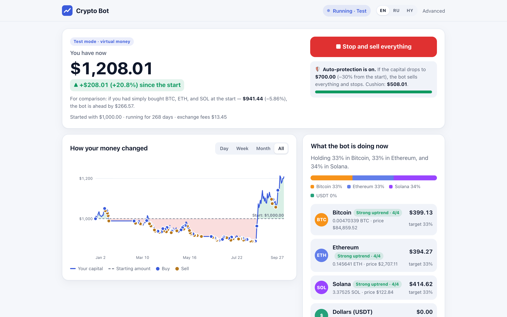

# Crypto Bot

A trend-following autopilot for crypto that trades on **Binance** or on **Solana** (through the
Jupiter aggregator) — and can publish every decision on-chain, so its track record can't be faked.



<sub>The dashboard replaying 2026 on real prices (Jan 1 → Sep 26, 2026): +20% vs −5% for buy & hold.
See [Results](#results) for how these numbers are produced.</sub>

- **One slow decision a day.** After each daily close the bot compares the price with its 20, 50,
  100 and 200-day moving averages and holds more of a coin the stronger its trend. No leverage, no
  shorts, few trades.
- **Binance or Solana.** Trade on a Binance spot account, or swap USDC ↔ cbBTC / WETH / SOL on
  Solana through Jupiter straight from your own wallet.
- **Risk-free modes.** A virtual account on real Binance prices, Binance Demo, or a Solana
  simulation on live Jupiter quotes — no keys needed to try it.
- **Proof-of-Trend.** Every daily decision can be written to Solana with the Memo program *before*
  any order executes. Block time can't be backdated, and anyone can recompute the signal.
- **Made for people.** A calm web interface in English, Russian and Armenian that explains every
  trade in plain words, plus an advanced mode with charts, signals and a live system log.

## Contents

1. [How it works](#how-it-works)
2. [Results](#results)
3. [Quick start](#quick-start)
4. [Trading modes](#trading-modes)
5. [Configuration](#configuration)
6. [Real money on Binance](#real-money-on-binance)
7. [Solana: swaps and the on-chain decision journal](#solana-swaps-and-the-on-chain-decision-journal)
8. [Using the web interface](#using-the-web-interface)
9. [Commands](#commands)
10. [Logs and diagnostics](#logs-and-diagnostics)
11. [Project structure](#project-structure)
12. [Development](#development)
13. [Safety](#safety)

## How it works

1. **Signal.** Once a day, after the 00:00 UTC close, the bot takes the daily closes of each asset
   (`BTCUSDT`, `ETHUSDT` by default, `SOLUSDT` optional) and counts how many of the 20/50/100/200-day
   simple moving averages the close is above.
2. **Target.** The capital is split equally between the assets. The share of an asset's slice held in
   the coin equals the share of averages below the price: 4 of 4 → fully in the coin, 2 of 4 → half,
   0 of 4 → fully in dollars (USDT on Binance, USDC on Solana).
3. **Rebalance.** The bot trades only when the portfolio drifted more than 10% of an asset's slice
   from the target. The decision is idempotent: restarts never trade twice on the same day.
4. **Protection.** Optional auto-protection sells everything and stops when capital falls below a
   chosen threshold (−20%, −30% or −40% from the start).

The bot manages only the amount you give it and the coins it bought itself; other funds on the
account or in the wallet are never touched.

## Results

Backtest on Binance daily data with the same code as live trading
(`src/allocator/domain/allocator-simulator.ts`), 0.1% fee + 0.05% slippage per side:

| $1,000 in BTC + ETH, 2018-01-01 → 2026-09-26 | Per year | Max drawdown | Growth | Sharpe |
| --- | --- | --- | --- | --- |
| Trend allocator | **+42.1%** | **48.8%** | ×21.6 | 1.06 |
| Buy & hold | +23.4% | 87.6% | ×6.3 | 0.66 |
| Random timing (median of 200) | +10.0% | 71.7% | — | 0.44 |

- The allocator beats 99.5% of random entry/exit timings with the same trading frequency.
- By year: 2018 −25% (buy & hold −76%), 2022 −30% (−65%), 2025 +11% (−5%).
- With SOL (2021-06-01 →): +34.3% a year vs +24.5%. In 2026 to date: +20.0% vs −5.0%.
  Last 12 months: +3.7% vs −32.2%.
- With DEX-level execution costs (0.03% per side, Jupiter), the same signals give +45.5% a year.

Reproduce with `npm run allocator:backtest` (options: `--from`, `--assets`, `--sma`, `--vol-target`,
`--help`). **Past performance does not guarantee future results.** The strategy earns on long trends
and loses on false signals in sideways markets; drawdowns of ~50% happened historically.

## Quick start

Requirements: **Node.js 22 or newer** (tested on 25) and npm. No exchange account or wallet is needed
for the test and simulation modes.

```bash
git clone https://github.com/narekhovhannsyan1408/crypto-bot.git
cd crypto-bot
npm install
cp .env.example .env        # optional: every setting has a safe default
npm run start
```

Open **http://127.0.0.1:3200** and press **Start in test mode** (virtual money on real Binance
prices) or **Start on Solana → Simulation** (live Jupiter quotes). The first decision is made right
away; after that the bot checks prices every 5 minutes and decides once a day.

Other ways to run:

```bash
npm run start:dev                      # watch mode for development
npm run build && npm run start:prod    # compiled build from dist/
```

The session survives restarts: state is kept in `.allocator-state.json` and the bot resumes where it
stopped. Stop it with **Stop and sell everything** in the interface.

## Trading modes

| Mode | Where | Money | What you need |
| --- | --- | --- | --- |
| Test mode (`paper`) | Virtual account on real Binance prices | Virtual | Nothing |
| Binance Demo (`live_testnet`) | Binance demo account | Not real | `BINANCE_TESTNET_API_KEY/SECRET` |
| Real money (`live_real`) | Your Binance spot account | Real | `BINANCE_API_KEY/SECRET`, `BOT_ALLOW_LIVE_REAL=true` |
| Solana simulation (`solana_sim`) | Live Jupiter quotes, no transactions | Virtual | Nothing |
| Solana real (`solana_real`) | Your Solana wallet, mainnet swaps via Jupiter | Real | `SOLANA_PRIVATE_KEY`, `BOT_ALLOW_SOLANA_REAL=true` |

Signals are always computed from Binance daily candles; the mode only decides where orders go.

## Configuration

All settings are environment variables, read from `.env` in the project root (or the file in
`BOT_ENV_FILE`). Values already set in the environment win over the file. See
[`.env.example`](.env.example) for a commented template.

| Variable | Purpose | Default |
| --- | --- | --- |
| `BOT_DASHBOARD_HOST` / `BOT_DASHBOARD_PORT` | Web interface address | `127.0.0.1` / `3200` |
| `BOT_ALLOCATOR_ASSETS` | Traded assets | `BTCUSDT,ETHUSDT` |
| `BOT_ALLOCATOR_SMA_PERIODS` | Moving-average periods | `20,50,100,200` |
| `BOT_ALLOCATOR_REBALANCE_THRESHOLD_PCT` | Minimum drift (share of an asset's slice) to trade | `0.1` |
| `BOT_ALLOCATOR_MIN_ORDER_USDT` | Minimum order size | `10` |
| `BOT_ALLOCATOR_VOL_TARGET` | Target yearly volatility, `0` = off | `0` |
| `BOT_ALLOCATOR_CHECK_INTERVAL_MS` | Price / auto-protection check interval | `300000` |
| `BOT_ALLOCATOR_STATE_FILE` | Session state file | `./.allocator-state.json` |
| `BOT_FEE_PCT` / `BOT_SLIPPAGE_PCT` | Costs modelled in test mode | `0.001` / `0.0005` |
| `BINANCE_API_KEY` / `BINANCE_API_SECRET` | Real Binance account (spot only) | — |
| `BOT_ALLOW_LIVE_REAL` | Allow real money on Binance | `false` |
| `BINANCE_TESTNET_API_KEY` / `BINANCE_TESTNET_API_SECRET` | Binance Demo account | — |
| `SOLANA_PRIVATE_KEY` or `SOLANA_KEYPAIR_PATH` | Wallet for real Solana swaps (base58 or JSON keypair) | — |
| `BOT_ALLOW_SOLANA_REAL` | Allow real swaps on Solana | `false` |
| `SOLANA_RPC_URL` | Mainnet RPC (a private one is recommended) | `https://api.mainnet-beta.solana.com` |
| `SOLANA_JUPITER_API_URL` / `JUPITER_API_KEY` | Jupiter API | `https://lite-api.jup.ag` / — |
| `SOLANA_SLIPPAGE_BPS` | Max slippage per swap | `50` (0.5%) |
| `SOLANA_MAX_PRIORITY_FEE_LAMPORTS` | Priority fee cap | `500000` |
| `SOLANA_MIN_SOL_FOR_FEES` | SOL kept aside for network fees | `0.02` |
| `SOLANA_TOKEN_MINTS` | Custom tokens, `BTC:<mint>:<decimals>,…` | cbBTC, WETH, SOL |
| `SOLANA_PROOF_ENABLED` | Publish decisions to Solana (Memo) | `false` |
| `SOLANA_PROOF_CLUSTER` / `SOLANA_PROOF_RPC_URL` | Network of the decision journal | `devnet` |
| `SOLANA_PROOF_KEYPAIR_PATH` | Journal wallet | `./.solana/proof-keypair.json` |
| `BOT_LOG_DIR` / `BOT_LOG_LEVEL` | Diagnostic journal | `./logs` / `debug` |
| `BOT_LOG_RETENTION_DAYS` / `BOT_LOG_MAX_FILE_MB` | Journal rotation | `14` / `10` |

## Real money on Binance

1. On Binance open **API Management**, create a key and allow **spot trading only**. Never enable
   withdrawals. A separate sub-account is recommended.
2. Add to `.env`:

   ```
   BINANCE_API_KEY=your_key
   BINANCE_API_SECRET=your_secret
   BOT_ALLOW_LIVE_REAL=true
   ```

3. Restart the bot, press **Start with real money**, choose the amount and confirm the risk notice.
   The interface shows your free USDT and refuses to start with more than that.

## Solana: swaps and the on-chain decision journal

**Swaps.** The Solana modes swap USDC for cbBTC, WETH (Wormhole) and native SOL through Jupiter.
In `solana_real` the bot signs the swap with your key, sends it to mainnet, waits for confirmation and
books the fill from the actual balance changes in the confirmed transaction. If the RPC loses the
response, the bot resolves the transaction by its signature until the blockhash expires, so a
network hiccup can never cause a double buy.

1. Create a **separate** wallet (for example a new account in Phantom) with USDC and ~0.05 SOL for
   network fees.
2. Add to `.env`:

   ```
   SOLANA_PRIVATE_KEY=your_base58_secret_key
   BOT_ALLOW_SOLANA_REAL=true
   SOLANA_RPC_URL=https://your-rpc-endpoint   # optional, recommended
   ```

3. Restart the bot and press **Start on Solana → Own wallet**.

**Proof-of-Trend journal.** Each daily decision (close prices, SMA votes, targets and planned orders)
is written to Solana with the Memo program before orders are sent — about 300–400 bytes and
5,000 lamports per day. It works with every mode, including Binance.

```bash
npm run solana:proof-wallet   # creates .solana/proof-keypair.json and asks devnet for free SOL
```

Then set `SOLANA_PROOF_ENABLED=true` and restart. If the faucet refuses, top the printed address up at
<https://faucet.solana.com>. The journal wallet lives in `.solana/` (git-ignored). Records appear in the
activity feed with a link to Solana Explorer.

## Using the web interface

- **Simple mode** (`/`): start and stop the bot, see capital and result, a comparison with buy & hold,
  the equity chart with every trade, what the bot holds now and why, and a plain-words activity feed.
- **Advanced mode** (`/advanced`): key metrics, equity and drawdown charts, the distance of the price
  to every moving average, allocation now vs target, execution and on-chain details, the decision
  journal with filters and a live system log.
- **Languages:** English (default), Russian and Armenian — switch in the header or open
  `http://127.0.0.1:3200/?lang=hy`. The choice is remembered in the browser.

The dashboard accepts commands only from its own page (Host and Origin checks), so another website
open in the same browser can't start or stop the bot.

## Commands

| Command | What it does |
| --- | --- |
| `npm run start` / `start:dev` / `start:prod` | Run the bot (dev watch mode / compiled build) |
| `npm run build` | Compile to `dist/` |
| `npm test` | Unit tests |
| `npm run test:e2e` | HTTP API end-to-end tests |
| `npm run lint` / `npm run format` | ESLint with fixes / Prettier |
| `npm run allocator:backtest -- --help` | Backtest the trend allocator on Binance history |
| `npm run solana:proof-wallet` | Create and fund the decision-journal wallet |
| `npm run diagnose -- --since 7d` | Incident report from the diagnostic journal |
| `npm run logs -- --help` | Filter the diagnostic journal |

## Logs and diagnostics

The bot writes a structured JSON journal to `logs/app-YYYY-MM-DD.jsonl` (one line per event, UTC days,
kept for 14 days): process start with version and settings (never keys), every daily decision with
signals and the order plan, every order and exchange or blockchain response, connection failures,
commands from the interface and crashes. Secrets are masked automatically.

If something went wrong, start with the report — it can be shared safely (never share `.env`):

```bash
npm run diagnose -- --since 7d > diagnose.md
npm run logs -- --since 3d --level warn
```

The event catalogue and investigation playbook are in [CLAUDE.md](CLAUDE.md).

## Project structure

```
src/
  allocator/        trend allocator: signal, rebalance planner, simulator, engine, brokers
    brokers/        paper, Binance spot (ccxt), Solana via Jupiter
  solana/           Jupiter client, tokens, wallet, swap accounting, Memo decision journal
  i18n/             message keys shared with the web dictionaries, legacy text migration
  web/public/       simple and advanced pages, i18n dictionaries (en, ru, hy)
  web/security/     Host/Origin guard for the dashboard
  observability/    structured journal, process monitor
  diagnostics/      diagnose and logs CLIs
  config/           environment configuration
  bot, strategy, trader, market, scanner, streaming, backtest/
                    legacy intraday strategies (research only, see below)
test/               end-to-end API tests
docs/hackathon/     Solana Hackathon deck, video and their build scripts
```

**Legacy intraday mode.** `BOT_STRATEGY_MODE=intraday` runs the original intraday strategies. They
showed no edge before costs on Binance history and lose money after fees, so they are kept only for
research and are not recommended.

## Development

- Tests: `npm test` (unit) and `npm run test:e2e`. Solana code is tested against a fake RPC and fake
  Jupiter, including blockhash expiry, lost sends and memo size limits.
- Translations: every visible text is a key in `src/web/public/i18n/{en,ru,hy}.json`. Server messages
  are `{ key, params }` objects (`msg()` / `LocalizedError` in `src/i18n/messages.ts`). The test
  `src/i18n/i18n.spec.ts` fails if a key is missing or placeholders differ between languages.
- Keep secrets out of logs: the journal masks fields named like `key`, `secret`, `token`, `signature`,
  so on-chain transaction ids are logged as `txId`.

## Safety

- Real money requires an explicit flag (`BOT_ALLOW_LIVE_REAL` or `BOT_ALLOW_SOLANA_REAL`) and a
  confirmation in the interface. Use a separate account or wallet with an amount you can afford to
  lose.
- Binance keys should allow spot trading only, without withdrawals. The Solana key stays on your
  machine; the bot only signs swaps and memo records.
- This is an automated trading program, not investment advice.

Hackathon materials (pitch deck, demo video and how they are built) are in
[docs/hackathon](docs/hackathon/README.md).
